## 1. Project Title

**CRYMA - Responsive Product Landing Page**

---

## 2. Introduction

### What is a Product Landing Page?
A product landing page is a standalone web page designed to promote a specific product or service. It is typically the first page a visitor sees when they click on an advertisement or a link, and its main goal is to convert visitors into customers.

### Why Landing Pages Are Important for Businesses
Landing pages are essential for businesses because they capture the attention of potential customers, communicate the value of a product or service, include clear calls-to-action to encourage conversions, and help build brand credibility and trust.

### Purpose of the Project
For this project, I designed and built a modern, responsive landing page for **CRYMA**, an e-commerce brand. I used **Laravel**, **Tailwind CSS**, and **Blade Components** to create a clean and reusable interface that shows off the brand's identity and products. This project gave me hands-on practice with component-based development, responsive design, and UI/UX principles.

---

## 3. Objectives
1. **Develop Responsive Web Interfaces** – I built responsive layouts using Tailwind CSS.
2. **Create Reusable Blade Components** – I used Blade Components to avoid repeating code.
3. **Apply Responsive Design Principles** – I made sure the page works on desktop, tablet, and mobile.
4. **Organize Frontend Components** – I followed Laravel best practices in structuring components.
5. **Implement Consistent UI Design** – I kept typography, spacing, colors, and layouts consistent.
6. **Document Frontend Architecture** – I wrote clear documentation for my reusable components.
7. **Publish a Portfolio Project** – I pushed my project to GitHub and shared it on LinkedIn.

---

## 4. Responsive Web Design

### Mobile-First Design
I built the CRYMA landing page with a mobile-first approach, so the layout works well on small screens first before scaling up to bigger devices.

### Responsive Breakpoints
I used Tailwind's breakpoints (`sm`, `md`, `lg`, `xl`) to adjust the layout, text size, and spacing depending on the screen size.

### Flexbox and CSS Grid
I used **Flexbox** to align items in the navbar, hero section, and footer. I used **CSS Grid** to arrange the feature cards, pricing cards, and testimonials.

### User Experience (UX)
A responsive design gives users a consistent and accessible experience no matter what device they use. It helps reduce bounce rates and keeps users engaged longer.

---

## 5. Tailwind CSS

### Utility-First CSS
> Tailwind CSS uses utility classes that let me style elements directly in the HTML. This makes development faster and keeps the styling consistent.

### Advantages of Tailwind CSS
> - **Consistency** – Predefined classes keep the design uniform.
> - **Customization** – I can customize everything through `tailwind.config.js`.
> - **Responsive Design** – Built-in responsive classes make it easy to build for any screen.
> - **Performance** – Unused styles are removed during the production build.

### Responsive Utility Classes
> Here is an example from my project:

```html
<div class="grid grid-cols-1 md:grid-cols-3 gap-6">
```

### Component Styling
> I used Tailwind utility classes to style reusable Blade components like buttons, cards, and the navbar. Some examples:
>
> - **Buttons** → `bg-teal-600`, `text-white`, `rounded-xl`, `hover:bg-teal-700`
> - **Cards** → `bg-white`, `rounded-lg`, `shadow-md`, `p-6`
> - **Navbar** → `flex`, `items-center`, `justify-between`, `bg-white`, `shadow-sm`

---

## 6. Blade Components

### What are Blade Components?
Blade Components are reusable UI elements in Laravel. They combine HTML and logic into a single file, so I can build consistent interfaces without copying the same code over and over.

### Why Reusable Components Improve Maintainability
- **Efficiency** – Write it once and use it anywhere.
- **Consistency** – If I change one component, it updates everywhere it is used.
- **Clean Code** – It reduces duplication and keeps my views organized.

### Benefits of Modular UI Development
- Easier to test and debug.
- Faster development.
- Better collaboration when working with a team.

## Sample Code Snippet (feature-card.blade.php)
blade
<div class="bg-white p-6 rounded-lg shadow-md text-center">
    <div class="text-4xl mb-4">{{ $icon }}</div>
    <h3 class="text-xl font-bold text-gray-800">{{ $title }}</h3>
    <p class="text-gray-600 mt-2">{{ $description }}</p>
</div>

### How It Is Used in the Page

<x-feature-card
    icon="🚚"
    title="Fast Delivery"
    description="Get your orders delivered quickly and reliably, right to your doorstep."
/>

### Blade Components Used
- navbar.blade.php
- hero.blade.php
- feature-card.blade.php
- pricing-card.blade.php
- testimonial-card.blade.php
- button.blade.php
- footer.blade.php

### Screenshot – Blade Components Folder
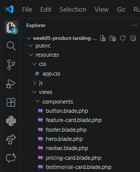

---

## 7. User Interface Design

### Color Palette
- **Primary**: `#0F6260` (Teal)
- **Secondary**: `#073B4C` (Dark Blue)
- **Accent**: `#EAF8F6` (Light Mint)
- **Neutral**: White, Gray, Black

 The teal and dark blue give the brand a clean and trustworthy feel, while the light mint accent softens the layout and keeps it from looking too heavy. A limited palette also makes the page feel more professional and easier on the eyes.

### Typography
 I used a clean and modern sans-serif font for readability and a professional look.

Sans-serif fonts are easier to read on screens, especially on smaller devices. Keeping the font consistent across all sections helps users follow the content without distraction.

### Iconography
 I used icons in the features section to make the content more engaging and easier to scan.

 Icons help break up text-heavy sections and give users quick visual cues, so they can understand the feature at a glance even before reading the description.

### Button Styles
 Primary buttons use a solid teal background with white text. Secondary buttons use an outline style.

 The contrast between the two button styles helps users know which action is more important. The primary button stands out and guides the user toward the main action, while the secondary button offers an alternative without competing for attention.

### Card Design
 The cards have rounded corners, subtle shadows, and consistent spacing to give the page a clean and polished look.

 Rounded corners and shadows give the cards a modern, friendly feel, while consistent padding makes the content easy to read. This improves the user experience by making the layout feel organized and easy to navigate.

### Layout Consistency
 I kept spacing and alignment consistent across all sections so the page feels cohesive from top to bottom.

 Consistent spacing and alignment make the page predictable for users. When sections follow the same rhythm, users can scan the page faster, and the overall design feels more professional and intentional.

---

## 8. Folder Structure

### Folder	Purpose
- resources/views/layouts	- Contains the main layout file (app.blade.php) that all pages extend.
- resources/views/components - Contains reusable Blade components like the navbar, hero, cards, and footer.
- resources/views/pages - Contains the main page views, such as home.blade.php.
- public - Holds publicly accessible assets like images, CSS, and JavaScript.
- screenshots - Stores all screenshots used for documentation.
- documentation - Stores the before-and-after comparison images and other documentation files.

---

```markdown
## 9. Screenshots

| Screenshot | Image |
|------------|-------|
| Before Design| 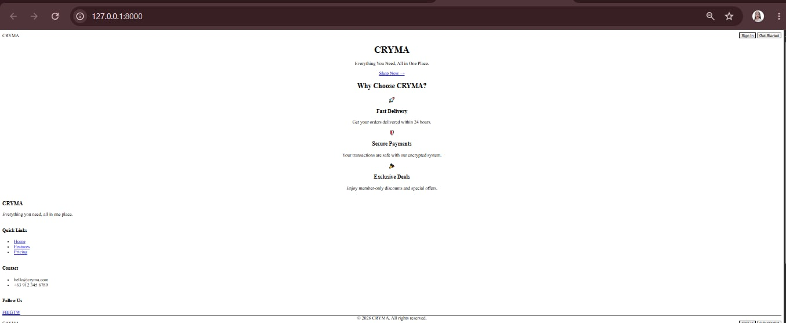 |
| After Design |  |
| Desktop Layout | 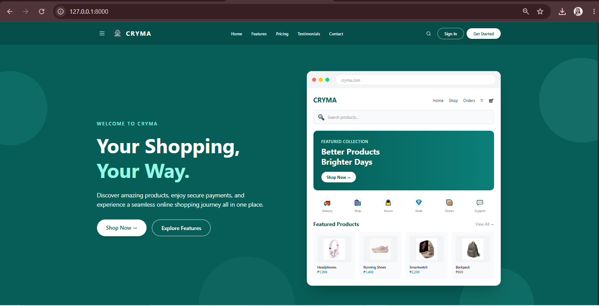 |
| Tablet Layout | 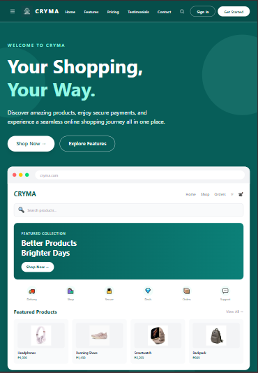 |
| Mobile Layout | 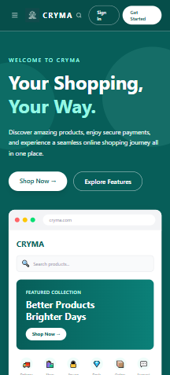 |
| Navigation Bar| 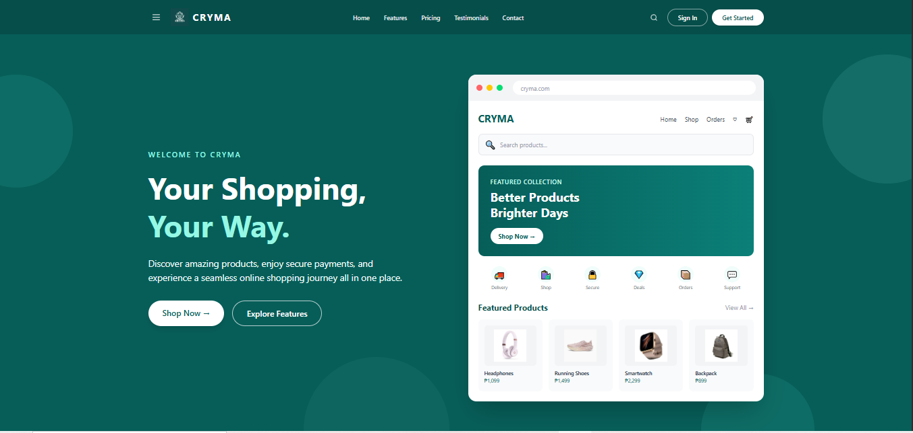 |
| Hero Section  | 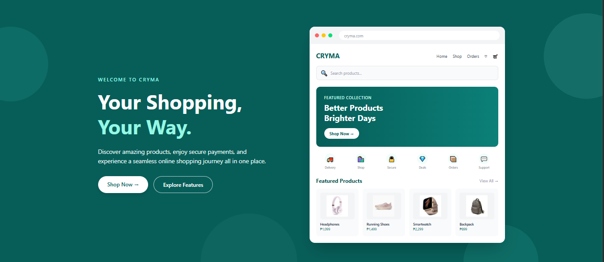 |
| Features Section | 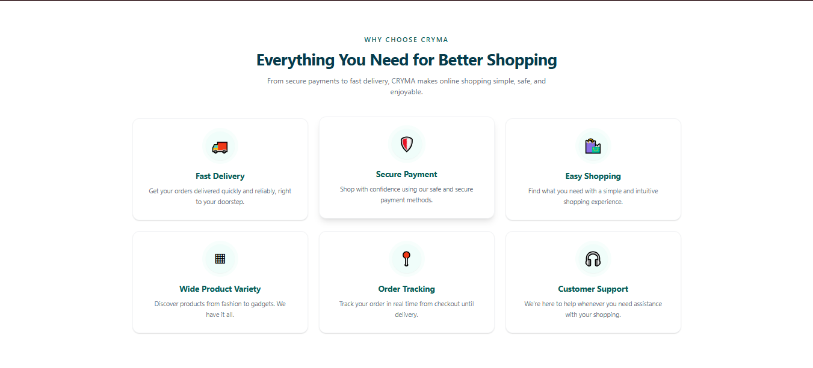 |
| Pricing Cards | 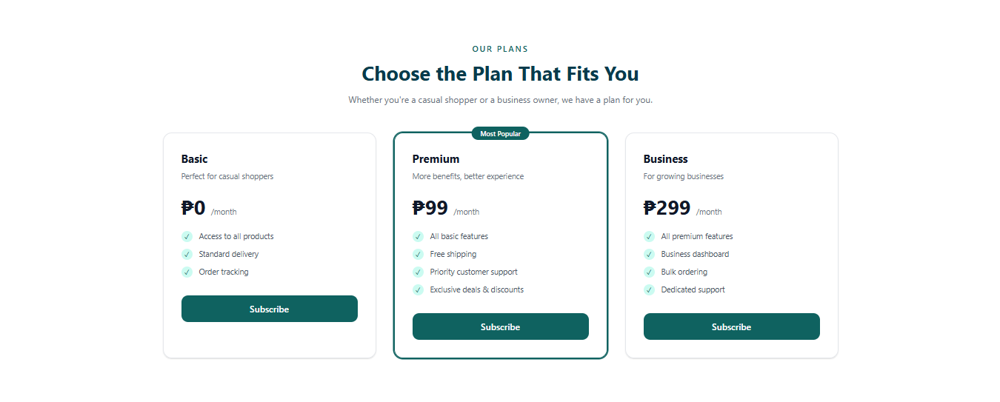 |
| Testimonials | 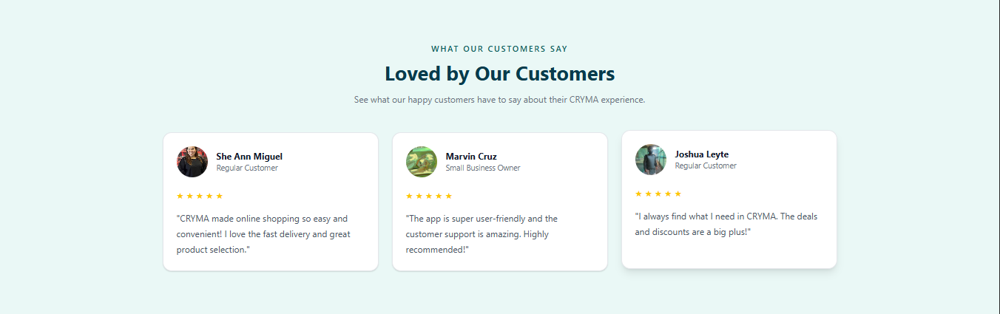 |
| Footer | 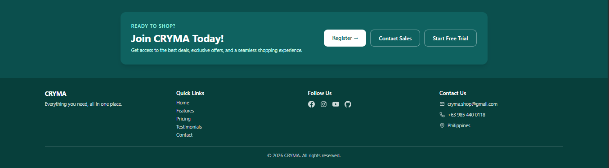 |
| VS Code Project Structure - 1 | 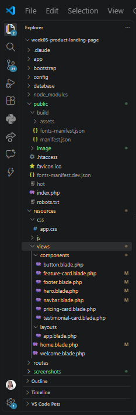 |
| VS Code Project Structure - 2 | 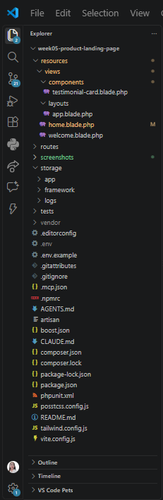 |
| Blade Components |  |
| GitHub Repository | 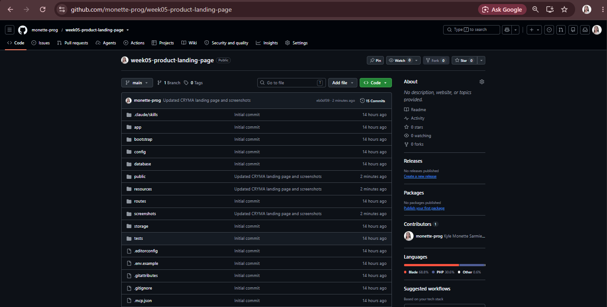 |
| Product Showcase | 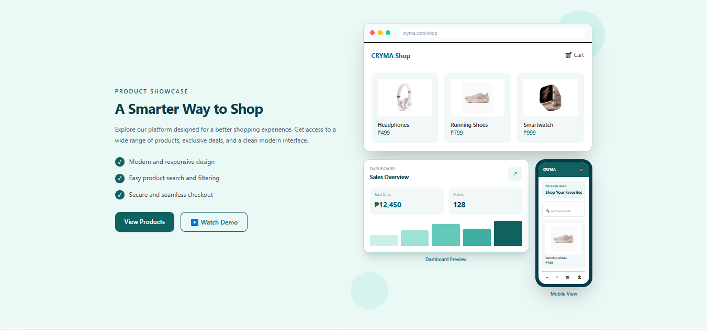 |

---

## 10. Before-and-After Comparison

### Before (Wireframe)


### After (Final Design)
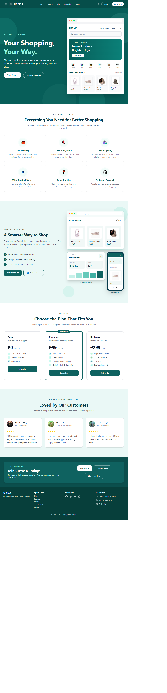

---

## 11. Reflection
- This project taught me how important responsive design and component-based development really are. I learned how to use Tailwind CSS to build a consistent and modern user interface, and how Blade Components can make code more maintainable and reusable. I also gained a deeper appreciation for UI/UX principles and how they affect user engagement and conversion rates.

---

## 12. References
- Laravel. (2026). Laravel - The PHP Framework for Web Artisans. https://laravel.com/docs
- Tailwind CSS. (2026). Tailwind CSS Documentation. https://tailwindcss.com/docs
- MDN Web Docs. (2026). Web development references. https://developer.mozilla.org/en-US/
